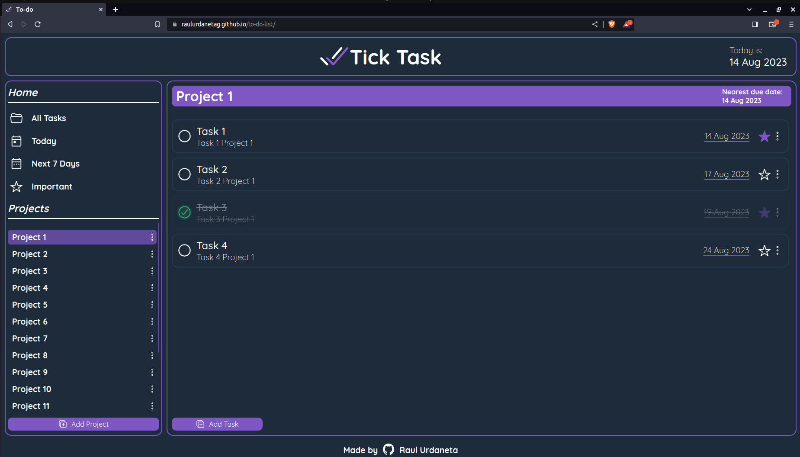

# to-do-list

# Functionality

- Add projects, and create tasks for each project.
- Edit project name, and edit tasks of each project.
- Can check if a task is completed, and if it's important.
- Show the nearest task due date of each project, excluding completed tasks.
- Able to see all tasks.
- Able to ses all task for current day.
- Able to see all tasks for current week.
- Able to see all important tasks.

# My learnings
- Used nested obecjts to create a storage object that contains a toDoList object that contains project objects each with many task objects.
- Installed and used npm custom package (date-fns) to handle date interactions, and Date objects.
- Used storage object to manage local storage.
- used DOM methods as insertBefore, insertAdjacentElement, focus.
- Used a global click listener, a window resize listener, adn a keydown listener.
- Used array methods as forEach, find, some, filter. 
- Applied styles with sass preprocessor.
- Added custom tab logo.
- Separated development and production config scripts.

[Live Preview](https://raulurdanetag.github.io/to-do-list) 👈
